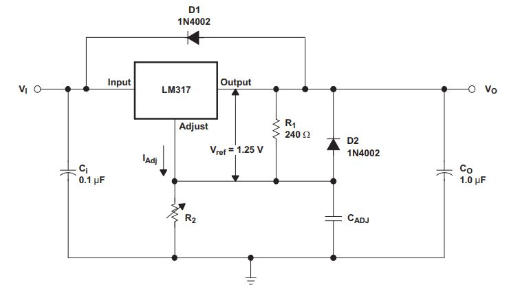

# LM317-Based-Adjustable-Voltage-Regulator-Circuit

### The LM317 device is an adjustable three-terminal positive-voltage linear regulator capable of supplying more than 1.5 A over an output-voltage range of 1.25 V to 37 V. It requires only two external resistors to set the output voltage.
### This is a adjustable voltage regulator circuit from LM317 datasheet shown on the image below.

### Design Requirements
